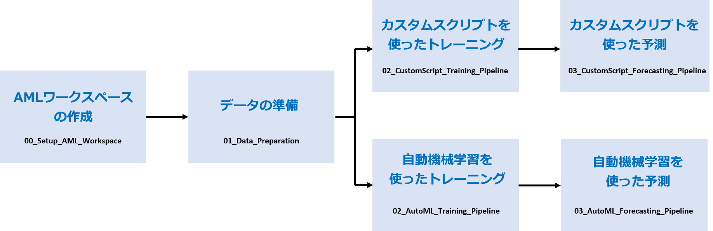

# Many Models Solution Accelerator

<!-- 
Guidelines on README format: https://review.docs.microsoft.com/help/onboard/admin/samples/concepts/readme-template?branch=master

Guidance on onboarding samples to docs.microsoft.com/samples: https://review.docs.microsoft.com/help/onboard/admin/samples/process/onboarding?branch=master

Taxonomies for products and languages: https://review.docs.microsoft.com/new-hope/information-architecture/metadata/taxonomies?branch=master
-->

現実の世界では多くの問題は複雑であり、単一の機械学習モデルでは解決できない場合があります。個々の店舗の売上を予測したり、何百もの油田の予測メンテナンスモデルを構築したり、個々のユーザーにエクスペリエンスを調整したりする場合でも、各インスタンスのモデルを構築すると、多くの機械学習の問題で結果が向上する可能性があります。

このパターンは、多くのインダストリーでは非常に一般的であり、多くの実世界のユースケースに適用されています。以下は我々が今まで見てきた、このパターンが使用されているいくつかの例です。

- エネルギーおよび公益事業会社は、何千もの油田、数百の風力タービン、または数百のスマートメーターの予測メンテナンスモデルを構築

- 何千もの店舗の従業員最適化モデルを構築する小売企業、キャンペーンプロモーション傾向モデル、販売する数十万の製品の価格最適化モデル

- 何千ものレストランで需要予測モデルを構築するレストランチェーン

- 銀行や金融機関は、ATM機械の入れ替えと、いくつかのATMのための現金補充のためのモデルを構築したり、個人のためのパーソナライズされたモデルを構築

- 各部門レベルで収益予測モデルを構築する企業

- ドキュメント管理会社において各州ごとのテキスト分析モデルと法的文書検索モデルを構築

Azure Machine Learning (AML) を使用すると、数百から数千のモデルのトレーニング、運用、管理が容易になります。このリポジトリは、トレーニングからスコアリング、モニタリングまで、Many models ソリューションを作成するエンドツーエンドのプロセスを通して説明します。

## 前提条件

このソリューション アクセラレータを使用するには、[Azure サブスクリプション](https://azure.microsoft.com/free/)と、以下で作成する[Azure Machine Learning ワークスペース](https://docs.microsoft.com/ja-jp/azure/machine-learning/how-to-manage-workspace?tabs=python)へのアクセスが必要です。

必須ではありませんが、ソリューションを理解するためには、Azure Machine Learning の基本的な理解が役立ちます。以下のリソースは、AML を理解するのに役立ちます：

1. [Azure Machine Learning の概要](https://azure.microsoft.com/ja-jp/services/machine-learning/)
2. [Azure Machine Learning のチュートリアル](https://docs.microsoft.com/ja-jp/azure/machine-learning/tutorial-1st-experiment-sdk-setup)
3. [Azure Machine Learning Sample Notebooks on Github](https://github.com/Azure/MachineLearningNotebooks)

## はじめに

### 1. リソースの展開

まず、リソースを Azure にデプロイします。次のボタンは、Azure Machine Learning と関連リソースをデプロイします：

### 2. 開発環境の設定

次に、Azure Machine Learning 用に開発環境を構成する必要があります。最も高速な起動方法なので、[コンピューティング インスタンス（旧 Notebook VM)](https://docs.microsoft.com/ja-jp/azure/machine-learning/how-to-configure-environment#compute-instance) を使用することをお勧めします。[EnvironmentSetup.md](./EnvironmentSetup.md)の手順に従って、コンピューティング インスタンスを作成し、リポジトリを複製します。

### 3. ノートブックの実行

開発環境をセットアップしたら、説明されている手順に従って Jupyter ノートブックを順番に実行します。最終的には、Azure Machine Learning で many models パターンを使用してどのようにトレーニング、スコアリング、および予測を行うかを理解するることができます：

Many models をトレーニングするには、次の 2 つの方法があります：

1. カスタム トレーニング スクリプトの使用
2. 自動 ML の使用

ただしどのオプションを選択しても、ワークスペースを設定してデータセットを準備するために必要な手順は同じです。

## 内容

このリポジトリでは、(シミュレートされた)食料品チェーンで、各オレンジジュースブランドと各店舗の予測モデルをトレーニングしてスコアリングを実行します。最終的には、今後数週間の売上を予測するために最大 11,973 のモデルを使用して売上を予測することになります。

このサンプルで使用されるデータは、シカゴ地域の食料品店からの販売データである[ドミニクのオレンジジュースデータセット](http://www.cs.unitn.it/~taufer/QMMA/L10-OJ-Data.html#(1))に基づいてシミュレートされます。

この機能は連続して実行されるように設計されたノートブック フォルダに分割されています。

### モデル トレーニングの事前準備：

| ノートブック       | 説明                                |
|----------------|--------------------------------------------|
| `00_Setup_AML_Workspace.ipynb`  | トレーニング用のコンピューティング クラスターの展開を含む、AML ワークスペースを作成および構成します。 |
| `01_Data_Preparation.ipynb`     | トレーニングおよび予測に使用されるデータセットを準備します。 |

### カスタム トレーニング スクリプトを使用してモデルをトレーニングする：

以下のノートブックは [`Custom_Script/`](Custom_Script/) フォルダの下にあります。

| ノートブック       | 説明                                |
|----------------|--------------------------------------------|
| `02_CustomScript_Training_Pipeline.ipynb`    | カスタム スクリプトを使用してデータセット内の各店舗およびオレンジ ジュース ブランドのモデルをトレーニングするパイプラインを作成します。 |
| `03_CustomScript_Forecasting_Pipeline.ipynb` | 前の手順でトレーニングされたモデルを使用して、将来のオレンジジュースの売上を予測するパイプラインを作成します。 |

### 自動化された ML を使用してモデルをトレーニングする：

以下のノートブックは、[`Automated_ML/`](Automated_ML/) フォルダの下にあります。

| ノートブック       | 説明                                |
|----------------|--------------------------------------------|
| `02_AutoML_Training_Pipeline.ipynb`    | 自動 ML を使用して、データセット内の各店舗およびオレンジ ジュース ブランドのモデルをトレーニングするパイプラインを作成します。 |
| `03_AutoML_Forecasting_Pipeline.ipynb` | 前の手順でトレーニングされたモデルを使用して、将来のオレンジジュースの売上を予測するパイプラインを作成します。 |

## 使い方ビデオ

Many models ソリューション アクセラレータの手順をステップごとに説明するこれらのハウツービデオを見て、カスタム トレーニング スクリプトと自動 ML の両方を使用してモデルを設定する方法を学習します。

### カスタム スクリプト

### 自動化されたML

## 主要なコンセプト

### ParallelRunStep

[ParallelRunStep](https://docs.microsoft.com/ja-jp/python/api/azureml-pipeline-steps/azureml.pipeline.steps.parallel_run_step.parallelrunstep?view=azure-ml-py)は、モデルの並列トレーニングを可能にし、一般的にバッチ推論に使用されます。この[ドキュメント](https://docs.microsoft.com/ja-jp/azure/machine-learning/tutorial-pipeline-batch-scoring-classification)では、ParallelRunStep に関する主要なコンセプトについて説明します。

### パイプライン

[パイプライン](https://docs.microsoft.com/ja-jp/azure/machine-learning/concept-ml-pipelines)を使用すると、機械学習プロジェクトにワークフローを作成できます。これらのワークフローには、実行速度、簡易性、繰り返し性、モジュール性など、多くの利点があります。

### 自動機械学習 (Automated Machine Learnin)

[自動機械学習](https://docs.microsoft.com/ja-jp/azure/machine-learning/concept-automated-ml)は、自動化された ML または AutoML とも呼ばれ、時間のかかる反復的な作業を自動化するプロセスです。データ サイエンティスト、アナリスト、および開発者は、モデルの品質を維持しながら、高い拡張性、効率性、生産性を備えた ML モデルを構築できます。

### その他のコンセプト

ParallelRunStep、パイプライン、自動機械学習の他にも、[ワークスペース](https://docs.microsoft.com/ja-jp/azure/machine-learning/concept-workspace)、[データセット](https://docs.microsoft.com/ja-jp/azure/machine-learning/concept-data#datasets)、[コンピューティング ターゲット](https://docs.microsoft.com/ja-jp/azure/machine-learning/concept-compute-target#train)、[PythonScriptStep](https://docs.microsoft.com/ja-jp/python/api/azureml-pipeline-steps/azureml.pipeline.steps.python_script_step.pythonscriptstep?view=azure-ml-py)、および [Azure Open Datasets](https://azure.microsoft.com/ja-jp/services/open-datasets/)などのコンセプトを使用しています。

## 貢献

このプロジェクトは、貢献と提案を歓迎します。詳細については、[貢献](CONTRIBUTING.md)セクションをご覧ください。

ほとんどの貢献には貢献者が、我々が貢献者の貢献を使用する権利を有し、実際に使用を許可することを宣言する共同使用許諾契約書(CLA)に同意する必要があります。詳細については、https://cla.opensource.microsoft.com を参照してください。

Pull要求を送信すると、CLA ボットは、CLA を提供し、適切に PR を行う必要があるかどうかを自動的に判断します (たとえば、ステータス チェック、コメントなど)。ボットの指示に従ってください。CLA を使用して、すべてのリポジトリで 1 回だけこれを行う必要があります。

このプロジェクトは、[マイクロソフトのオープンソース行動規範 (Microsoft Open Source Code of Conduct)](https://opensource.microsoft.com/codeofconduct/)を採用しています。詳細については、[行動規範に関する FAQ](https://opensource.microsoft.com/codeofconduct/faq/)を参照するか、その他の質問やコメントがある場合には[opencode@microsoft.com](mailto:opencode@microsoft.com) に連絡してください。